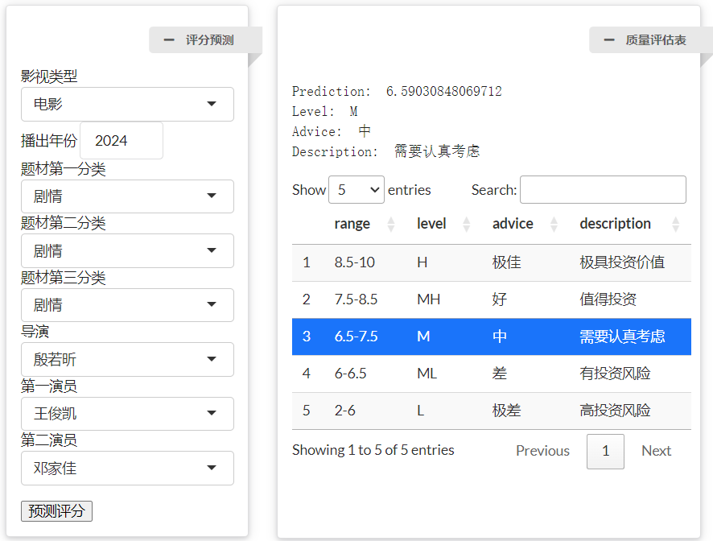

## 项目简介
本项目旨在通过数据分析和建模，评估国内影视作品（包括电视剧和电影）的投资风险。通过对影视作品的评分、主创人员（导演、演员）的综合评分以及相关指标的分析，为投资者提供一个数据驱动的决策工具，帮助其判断影视作品的投资价值。

## 项目背景
近年来，国内影视行业高投资趋势明显，但高投资并不一定等于高回报。一些高投资作品如《传说》《上海堡垒》《逆行人生》等出现了亏损现象。与此同时，小体量投资的短剧因其风险较小而受到更多投资者的青睐。因此，如何预测影视作品未来的收益（如收视率、票房）成为投资方关注的重点。本项目通过预测影视作品的评分（以豆瓣网评分为参考），为投资方提供一种衡量影视作品投资价值的方法。

## 数据获取与预处理

### 数据来源
1. **豆瓣电影数据**：通过Python的Selenium库爬取豆瓣电影和电视剧的相关数据，包括作品名、上映时间、类型、导演、主演和评分等。
2. **巨量算数数据**：通过爬取巨量算数平台数据，获取导演和演员在过去30天内的抖音平台关键词搜索指数、年龄分布、性别分布及TGI指数等。

### 数据预处理
1. **初始数据清洗**：对爬取的数据进行格式化处理，包括拆分类型列、保留主要导演和演员信息、删除特殊类型作品等。
2. **个体指标挖掘**：通过巨量算数数据和内部数据挖掘，为主创人员（导演、演员）增加量化指标，如导演和演员的综合评分、年龄分布、性别分布等。
3. **数据汇总**：最终处理后共计460条数据，每条数据包含34个变量，涵盖影视作品的基本信息、主创人员的综合评分及相关指标。

## 数据分析

### 词云图分析
1. **影视作品名称**：通过分词和词频统计，生成影视作品名称的词云图，分析作品命名的多样性。
2. **影视作品类型**：对影视作品的类型进行词频统计，生成词云图，分析电影和电视剧在类型选择上的共性和差异。

### 聚类分析
1. **影视作品聚类**：对“剧情”类型的电影和电视剧分别进行Kmeans聚类，分析不同聚类的特征，如导演和演员综合评分、人群画像、电影评分等。
2. **主创聚类**：将导演和演员通归为主创，进行Kmeans聚类，分析不同聚类的特征，如导演评分、演员评分、人群画像等。

### 主创分析
以“邓超”为例，分析其导演和主演的影视作品题材偏好及评分趋势，生成雷达图和折线图进行可视化。

### 相关性分析
1. **主创指标相关性**：计算主创人员的数值指标之间的相关系数，分析指标之间的相关性。
2. **影视作品评分相关性**：计算影视作品的数值指标与评分之间的相关系数，分析各指标与评分的相关性。

## 模型预测

### 模型选择
1. **变量选择**：剔除影视作品名称、导演和演员信息，将评分作为因变量，其余29个变量作为自变量。
2. **模型选择**：使用R语言的线性回归模型和随机森林模型进行回归分析。

### 模型训练
1. **数据划分**：按照19:1的比例划分训练集与测试集。
2. **模型评估**：线性回归模型的MSE为0.4959461，RMSE为0.7042344，R²为0.8296937；随机森林模型的MSE为0.6955161，RMSE为0.8339761，R²为0.484682。

### 实际应用
1. **输入变量缩减**：将用户输入变量缩减到8个，包括影视作品类型、播出年份、三个题材、导演和两个演员。
2. **预测示例**：对电影《野孩子》和电视剧《小巷人家》进行预测，分别给出评分和投资建议。

## 实验总结
本项目通过对影视作品和主创人员的分析，总结了与电影评分相关的一系列指标，如主创综合评分、人群画像等。项目提供了一个数据驱动的工具，帮助投资者降低投资风险。然而，项目的数据量较小且部分数据为手动填充，未来需要进一步扩大数据量以提高模型的准确性和泛化能力。

## 项目技术栈
1. **数据爬取**：Python（Selenium库）
2. **数据处理与分析**：R语言（数据处理、可视化、建模）
3. **可视化工具**：Wordcloud2、fmsb、ggplot等
4. **建模工具**：线性回归模型、随机森林模型

## 预测界面展示

